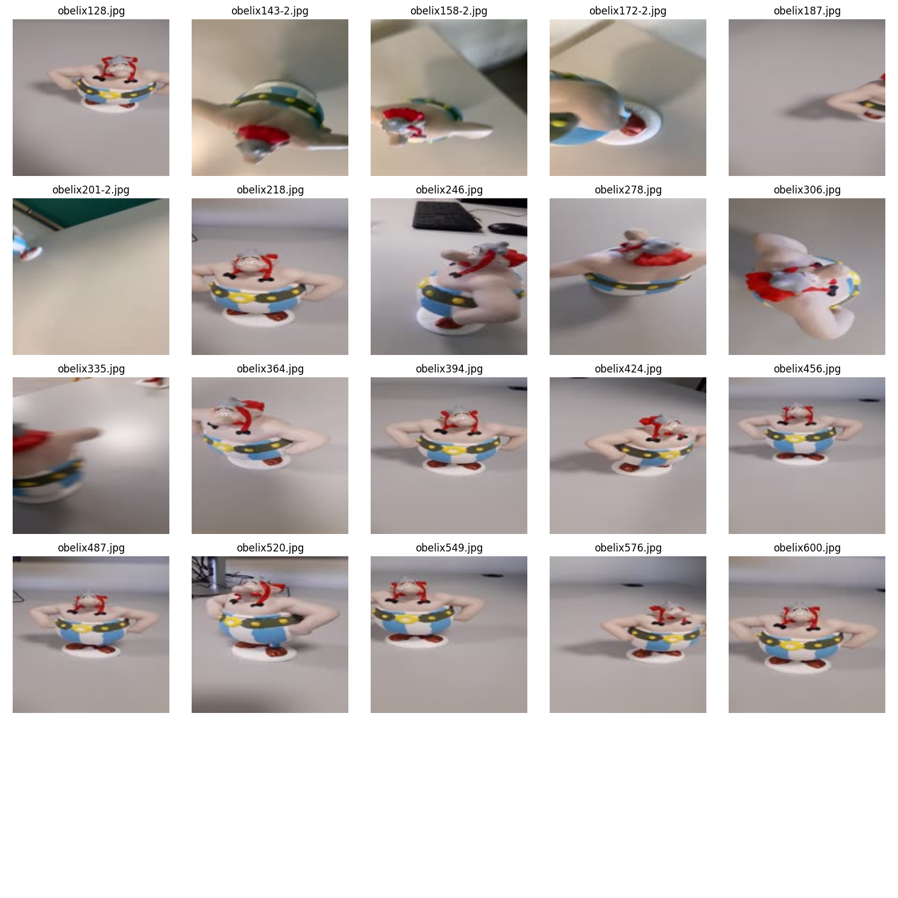
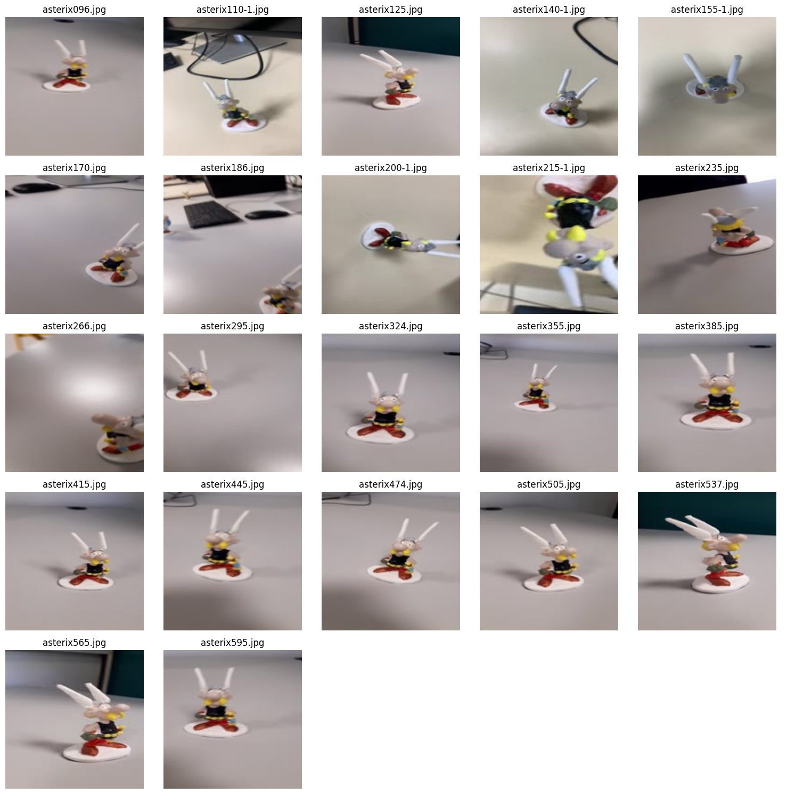
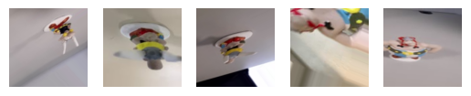
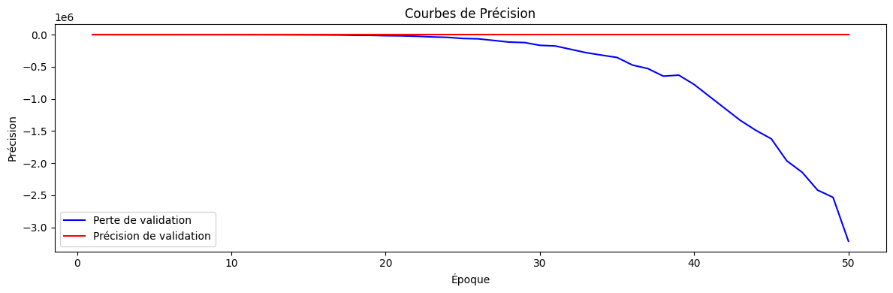

# Deep Learning

## Introduction

> L'objectif de ce projet est principalement de réalisé un model de donnée qui serviras a trouver asterix ou obelix sur une image. 

# Sommaire

### 1. Acquisition de donnée
### 2. Apprentissage
### 3. Test
### 4. Application Web

## Acquisition de donnée

> Pour gerer l'acquisition des donnée nous avons réalisé plusieurs vidéo dans des cadres différents et sous tout les angles de figurine représentant asterix et Obelix




> Nous avons pris quelque échantillons aléatoire de c'est vidéo pour avoir un jeux de validation (envrion 20%)

> Ensuite pour que les données soit plus aléatoire et évité le surapprentissage, nous avons réalisé une nouvelle génération d'image grace au existante, en fonctionnant avec des modifications simple, rotation étirement, rescale etc.

(Exemple)


### 2. Apprentissage

> Pour l'apprentissage nous avons utilisé un model CNN en utilisans la librairie tensorflow en nous servant des images utilisé juste avant

Voici le code: 
```py
# Définir l'emplacement des données d'entraînement et de validation
chemin_asterix = '/content/drive/MyDrive/Colab_Notebooks/TP2-3/Asterix/train/asterix'
chemin_obelix = '/content/drive/MyDrive/Colab_Notebooks/TP2-3/Asterix/train/obelix'

# Paramètres du modèle


# Créer un générateur de données
datagen = ImageDataGenerator(rescale=1.0/255.0, validation_split=0.2)

# Charger et prétraiter les données d'entraînement
train_generator = datagen.flow_from_directory(
    '/content/drive/MyDrive/Colab_Notebooks/TP2-3/Asterix/train',
    target_size=(largeur, hauteur),
    batch_size=batch_size,
    class_mode='binary',
    subset='training'
)

# Charger et prétraiter les données de validation
validation_generator = datagen.flow_from_directory(
    '/content/drive/MyDrive/Colab_Notebooks/TP2-3/Asterix/validation',
    target_size=(largeur, hauteur),
    batch_size=batch_size,
    class_mode='binary',
    subset='validation'
)

# Construire le modèle CNN
model = Sequential()

model.add(Conv2D(32, (3, 3), input_shape=(largeur, hauteur, 3)))
model.add(Activation('relu'))
model.add(MaxPooling2D(pool_size=(2, 2)))

model.add(Conv2D(64, (3, 3)))
model.add(Activation('relu'))
model.add(MaxPooling2D(pool_size=(2, 2)))

model.add(Conv2D(128, (3, 3)))
model.add(Activation('relu'))
model.add(MaxPooling2D(pool_size=(2, 2)))

model.add(Flatten())
model.add(Dense(256, activation='relu'))
model.add(Dropout(0.5))
model.add(Dense(1, activation='sigmoid'))

# Compiler le modèle
model.compile(loss='binary_crossentropy',
              optimizer=Adam(learning_rate=0.0001),
              metrics=['accuracy'])

# Entraîner le modèle
# Réduisez le nombre d'échantillons pour l'entraînement et la validation
train_samples = 5  # Remplacez ce nombre par la taille de votre échantillon d'entraînement
validation_samples = 5 # Remplacez ce nombre par la taille de votre échantillon de validation

# Réduisez le nombre d'étapes par époque et le nombre d'étapes de validation
historique = model.fit(train_generator, steps_per_epoch=train_samples ,
                      epochs=epochs, validation_data=validation_generator,
                      validation_steps=validation_samples )


# Enregistrer le modèle entraîné au format h5
model.save("/content/drive/MyDrive/Colab_Notebooks/TP2-3/model.h5")
```

### 3. Test

> Pour tester l'algorithme nous avons réalisé plusieurs courbe qui pour chaque epochs nous donnent le niveau de précision



### 4. Application Web

> pour réalisé l'application web il fallait tout d'abord convertir le model dans un format de fichier que peut être lue par tensorflow.js les fichiers h5 ne sont pas compatible on vas donc le transformer en json en utilisant la librairie python tensorflowjs

> ensuite il nous reste plus qu'a utilisé le model

#### GetImage

```py
function getImage() {
  if (!fileInput.files[0]) throw new Error('Image not found');
  const file = fileInput.files[0];

  if (!acceptedImageTypes.includes(file.type)) {
    inputError.classList.add('show');
    throw Error('The uploaded file is not an image');
  } else inputError.classList.remove('show');

  const reader = new FileReader();

  reader.onload = function (event) {
    const dataUrl = event.target.result;

    const imageElement = new Image();
    imageElement.src = dataUrl;

    imageElement.onload = function () {
      image.setAttribute('src', this.src);
      image.setAttribute('height', this.height);
      image.setAttribute('width', this.width);

      var dataImage = tf.browser.fromPixels(image)
      classifyImage(dataImage.reshape(1,150,150,32));
    };

    document.body.classList.add('image-loaded');
  };

  reader.readAsDataURL(file);
}
```

#### LoadModel

```py
async function loadModel() {
  model = await tf.loadLayersModel('tfjs_files/model.json');
  document.body.classList.remove('loading');

  fileInput.addEventListener('change', getImage);

  return model
}

let model = loadModel();
```

#### ClassifyImage

```py
function classifyImage(dataImage) {

  const predict = model.predict(dataImage);

  const axis = 1;
  const predictions = Array.from(output.argMax(axis).dataSync());
  console.log(predictions);

  if (predictions[0] == 1) {
      description.innerText = 'Asterix!';
  } else if (predictions[0] == 2) {
      description.innerText= 'Obelix!';
  } else {
      description.innerText = 'Aucune idée' + predictions[0];
  }
}
```